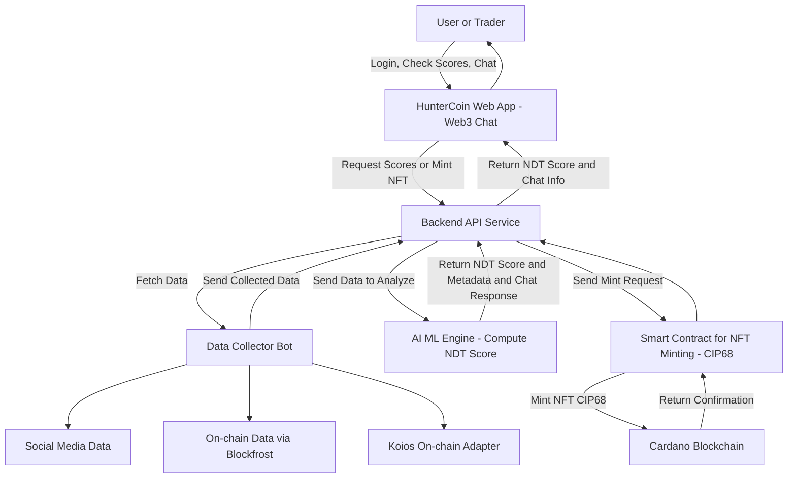

# System Architecture Overview – MemeCoin Score Platform

This diagram illustrates the **HunterCoin Web3 Chat platform**, which collects, analyzes, and displays meme coin scores for users in real time.

## Users / Traders
- Log in to the platform, check meme coin scores, and interact via Web3 chat.

## Frontend (Web App)
- Provides a dashboard for users to view scores, request updates, and participate in chat.
- Communicates with backend APIs to fetch scores.

## Data Collection Bot
- Collects social media trends, on-chain data via Blockfrost, and Koios adapter data.
- Preprocesses and sends data to the backend for analysis.

## Backend API Service
- Connects the frontend, bot, and AI engine.
- Processes user requests and forwards data to AI for score calculation.

## AI / ML Engine
- Computes NDT Scores for meme coins based on collected data.
- Returns scores, metadata, and chat responses to the backend.

## Data Flow
- Users → Web App → Backend → Bot collects data → AI computes scores → Backend sends results → Users view scores on Web App.

This architecture ensures **transparent, real-time, AI-driven meme coin scoring**, allowing users to **check coin scores and engage with the platform efficiently**.

